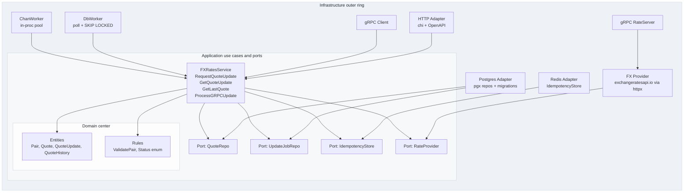
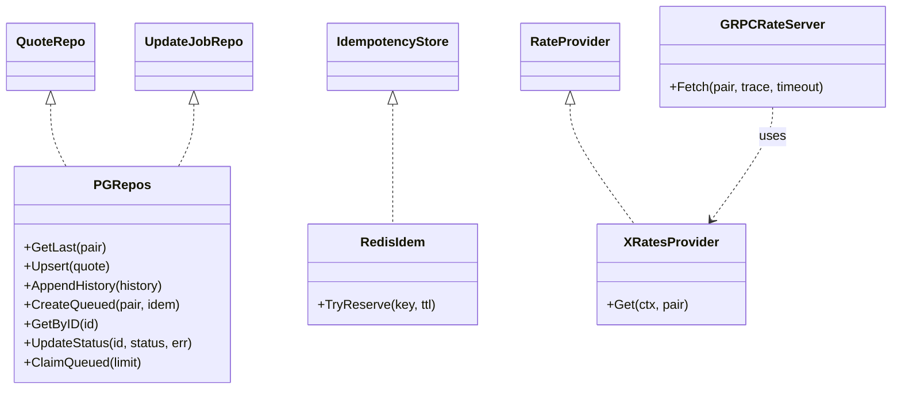

# Clean Architecture (Layered View)

Dependencies flow **inward only**:

Infrastructure ⟶ Application (Ports/Use Cases) ⟶ Domain (Entities/Value Objects).

## Concentric Layers (radial approximation)



Ports and Adapters Matrix (quick map)



Runtime Modes

	•	WORKER_TYPE=db — external DbWorker claims queued jobs from Postgres and writes results back.

	•	WORKER_TYPE=grpc — API returns 202 and runs a background call to gRPC RateServer; API persists results.

	•	WORKER_TYPE=chan — API enqueues into an in-process channel pool; workers fetch rates and persist.

Common read paths:

	•	GET /quotes/last?pair=X/Y reads quotes.

	•	GET /quotes/updates/{id} reads quote_updates and joins quotes_history for price/time.

In `README.md`, add under any “Documentation” or “Project Docs” section:

```md

- [Clean Architecture (layers)](docs/CLEAN_ARCH.md)

⸻

This gives you the “domain-at-center” feel while keeping it Mermaid-only (works great in GitHub/Renderers). If you later want a true circular visual, we can also export a small SVG via a draw.io source, but this keeps it simple and versionable.

